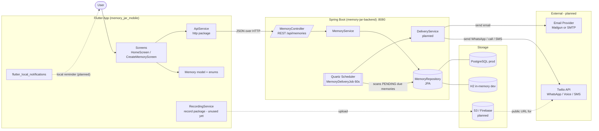
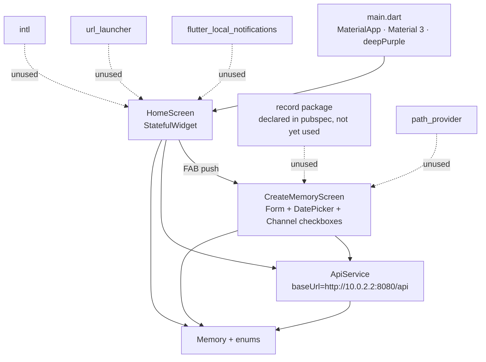
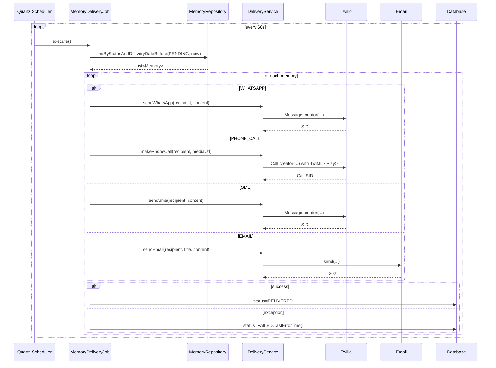
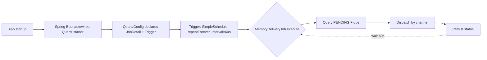
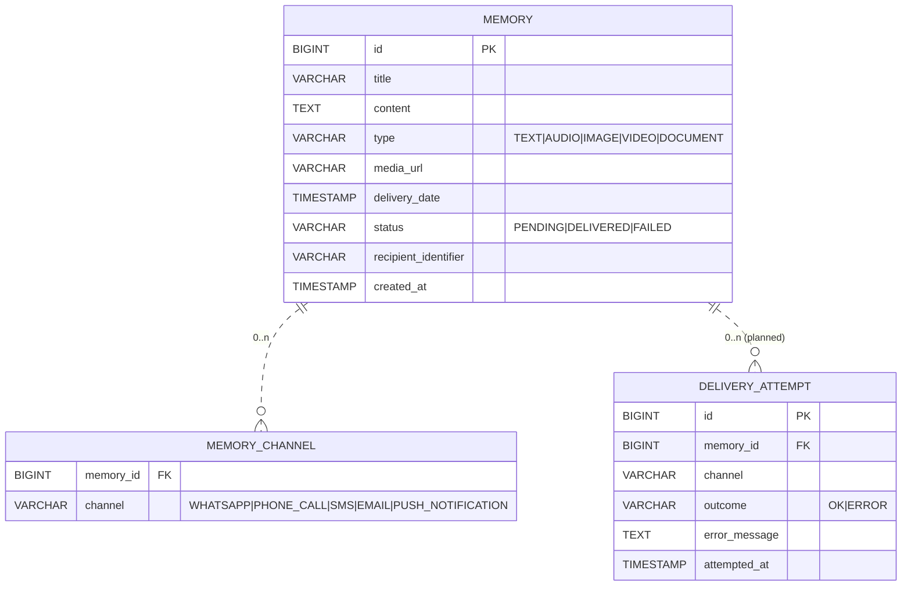

# SYSTEM_ARCHITECTURE.md — Memory Jar

> All diagrams in Mermaid. Drawn from verified disk state and the vision in `FULL_IMPLEMENTATION_GUIDE.md`. Dotted lines / `[planned]` nodes mark components that are designed but not yet on disk.

---

## 1. End-to-End System View



---

## 2. Backend Architecture (Spring Boot, planned modules)

```mermaid
flowchart TB
  subgraph Web Layer
    RC[MemoryController<br/>@RestController]
  end
  subgraph Service Layer
    MS[MemoryService<br/>@Service]
  end
  subgraph Persistence Layer
    MR[MemoryRepository<br/>extends JpaRepository]
  end
  subgraph Domain
    M[(Memory<br/>@Entity)]
    E1[MemoryType]
    E2[DeliveryChannel]
    E3[MemoryStatus]
  end
  subgraph Scheduling
    QC[QuartzConfig<br/>Trigger every 60s]
    QJ[MemoryDeliveryJob<br/>@DisallowConcurrentExecution]
  end
  subgraph Integration[planned]
    DS[DeliveryService interface]
    TDS[TwilioDeliveryService]
    EDS[EmailDeliveryService]
  end

  RC --> MS
  MS --> MR
  MR --> M
  M --- E1
  M --- E2
  M --- E3
  QC --> QJ
  QJ --> MR
  QJ --> DS
  DS <|.. TDS
  DS <|.. EDS
```

**Package convention (planned):** `com.memoryjar.{controller, service, model, repository, config, delivery, delivery.twilio, delivery.email}`.

---

## 3. Mobile Architecture (Flutter)



State management: bare `setState` + `FutureBuilder`. No Provider/Riverpod yet (guide §4.2 recommends adopting one when state grows).

---

## 4. Delivery Flow (planned, the core Phase 2 work)



---

## 5. Scheduling Flow



**Concurrency:** mark `MemoryDeliveryJob` with `@DisallowConcurrentExecution` to prevent overlapping runs on the same node.

**Scaling caveat:** the 60s poll is fine for a single instance. For HA, switch to a JDBC-backed `JobStore` (Quartz supports it; tables auto-created with `spring.quartz.job-store-type=jdbc`) and consider sharding via `PARTITION` or leader election.

---

## 6. Database Relationships (planned)



**Recommendation:** model channels as a join table. Avoids comma-separated parsing and lets you add channel-specific delivery metadata later.

---

## 7. External Service Integrations

| Service | Purpose | Phase | SDK / Library | Config |
|---|---|---|---|---|
| Twilio | WhatsApp send, TwiML voice call, SMS | 2 | `com.twilio.sdk:twilio:10.x` (NOT in `build.gradle` yet) | `twilio.account.sid`, `twilio.auth.token`, `twilio.whatsapp.number`, `twilio.voice.number` |
| Mailgun / SMTP | Email delivery | 2 (alongside Twilio) | `spring-boot-starter-mail` | `spring.mail.*` or Mailgun API key |
| AWS S3 / Firebase | Media upload | 3 | TBD | bucket + credentials |
| FCM / APNS | Push notifications (in addition to Twilio) | 3+ | TBD | server key / APNS cert |

**Twilio voice requires a public audio URL** — the `mediaUrl` field on `Memory` must point to a hosted file. This is the bridge between Phase 2 and Phase 3: a phone-call memory cannot be delivered without a hosted media asset, so the audio upload path becomes a Phase 2 prerequisite for the `PHONE_CALL` channel.
